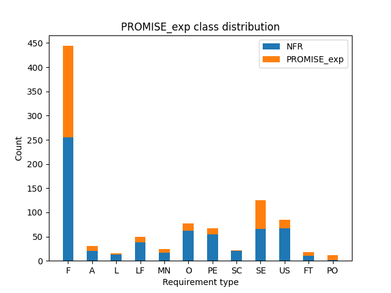
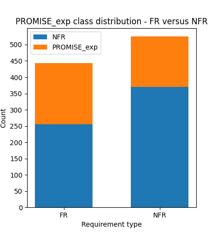
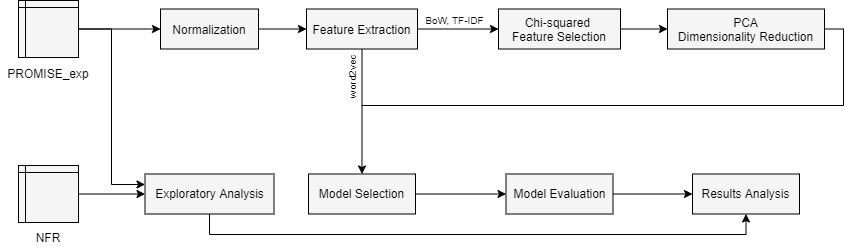
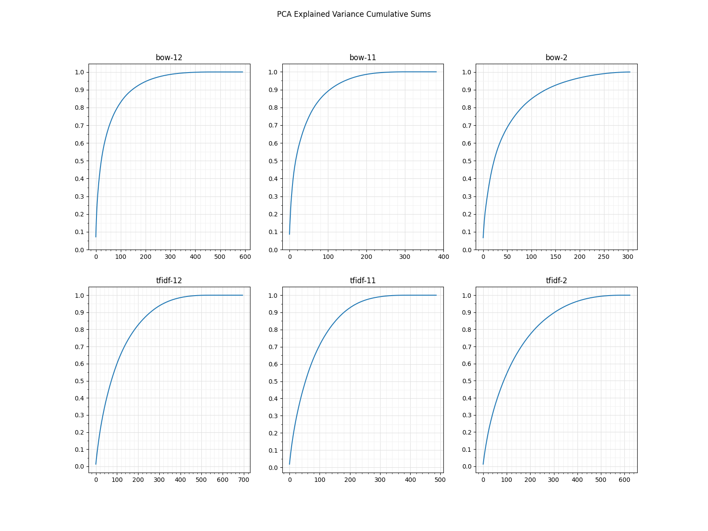

# Software requirements classification using machine learning algorithms

## Table of Contents
   1. [Introduction](#introduction)
   2. [Background](#background)
   3. [Data set overview](#data-set-overview)
   4. [Methodology](#methodology)
      1. [Normalization](#normalization)
      2. [Feature extraction](#feature-extraction)
	  3. [Feature selection](#feature-selection)
      4. [Model selection](#model-selection)
	  5. [Model evaluation](#model-evaluation)
   5. [Results](#results)
      1. [Performance of the algorithms used on the BoW and TF-IDF features](#performance-of-the-algorithms-used-on-the-bow-and-tf-idf-features)
      2. [Performance of the RNNs used on the word2vec representation](#performance-of-the-rnns-used-on-the-word2vec-representation)
	  3. [Confusion matrices for the SVM / TF-IDF models](#confusion-matrices-for-the-svm--tf-idf-models)
	  4. [Analysis](#analysis)
   6. [Conclusions](#conclusions)
   7. [References](#references)

## Introduction

The purpose of this project is to provide insight in the comparative performance of classifiers using the prevalent machine learning algorithms and feature extraction techniques in the field of natural language processing, on a recent expansion of the tera-PROMISE NFR data set. The original  data set has represented the primary data source for numerous previous research publications concerning automated classification of software requirements. Three separate classification problems were considered: 2-class - functional versus non-functional requirements, 11-class - non-functional requirements, 12-class - functional and non-functional requirements classes. In addition to the common approach for the 12-class problem, a two-step hierarchical method has been constructed and evaluated. Feature extraction was performed using three separate techniques: Bag of Words, Term Frequency - Inverse Document Frequency and word2vec. Chi-squared feature selection was performed on the BoW and TF-IDF representations, then Principal Component Analysis was used to further reduce the dimensionality of the data. The following machine learning algorithms were applied to the BoW and TF-IDF data: Multinomial Naive Bayes, Logistic Regression, Gradient-Boosted Decision Trees, k-Nearest Neighbors, Support Vector Machines, feedforward Neural Networks. The word2vec word embeddings were used for training Long Short Term Memory and Gated Recurrent Unit recurrent neural network classifiers. The performance of the models was analyzed in isolation, compared to the other models, and in the wider context of the previous publications, compared to which the performance is nearly identical.

## Background

As non-functional requirements, or system quality attribute requirements, are independent and complimentary to functional requirements, system architects need to differentiate between the two types during the design phase so that they are mapped to the appropriate architectural components. During requirements elicitation however, the functional requirements are predominantly focused; the question when the non-functional requirements are to be elicited, i.e. before, simultaneously, or after the functional requirements, remains unanswered, and in practice there is large variety in how these are specified [\[9\]](#ref-9). In addition, since some software engineering processes, e.g. agile development, are human-centric, the non-functional requirements are likely to be stated implicitly, if stated at all [\[10\]](#ref-10); as a consequence, the two types of requirements are often intertwined in requirements specifications documents. A survey has revealed that more than sixty percent of the reviewed projects have failed due to ignorance of non-functional requirements [\[11\]](#ref-11). The manual task of non-functional requirements extraction and classification is time consuming and error prone, hence the need for automatic and semi-automatic approaches [\[7\]](#ref-7)[\[8\]](#ref-8).

Concerning requirements discovery and extraction, research has been made on automated extraction and classification of software requirements from Twitter posts and app reviews on Play Store or App Store. Lu et al. performed classification on user ratings from among four non-functional requirement types: reliability, usability, portability and performance [\[13\]](#ref-13). Iqbal et al. present a summary of the research in the field [\[12\]](#ref-12). The text corpora of the corresponding research differ to those comprised of formal project requirements specifications in terms of linguistic features: the requirements are specified using a specific terminology whereas reviews and tweets use common speech; the sentence structure and the degree of impartiality in speech are also different.

The most prevalent data set in previous research is tera-PROMISE NFR [\[4\]](#ref-4). Lima et al. recently expanded this data set forming PROMISE_exp, the motivation of the endeavor being the overly modest size of the original for applications to purposes that would use machine learning algorithms [\[1\]](#ref-1). Canedo et Mendes have constructed classifiers using the MNB, LR, kNN and SVM algorithms over BoW and TF-IDF representations of the expanded data set [\[2\]](#ref-2). Rahman et al. made a comparative study on the performance of LSTM and GRU recurrent neural networks on a word2vec representation of tera-PROMISE NFR to that of convolutional neural networks in previous research [\[3\]](#ref-3).

This project expands on the previous research of Canedo et Mendes [\[2\]](#ref-2) by additionally applying GBDT and feedforward NNs over BoW and TF-IDF representations, and repeats the experiment of Rahman et al. [\[3\]](#ref-3) on the expanded data set. Additionally it features another approach which naturally presents itself to the 12-class problem: two-step hierarchical classification, and briefly explores the usability of bigram features for the problem.

## Data set overview

The original open source tera-PROMISE repository consists of 625 labeled natural language requirements, of which 255 functional and 370 non-functional [\[4\]](#ref-4). The corpus has been formed by collecting requirements from fifteen separate projects. The following classes of non-functional requirements are represented: availability, legal, look-and-feel, maintainability, operability, performance, scalability, security, usability, fault tolerance, portability.

Motivated by the reported challenges concerning the size of the tera-PROMISE NFR data set, Lima et al. created the expanded PROMISE_exp data set, which contains 444 functional requirements and 525 non-functional requirements [\[1\]](#ref-1). The authors have used the Google search engine to collect Software Requirements Specification documents, then did manual analysis, extraction and classification, followed by validation of the resulting requirement types using expert consensus. Care has been taken that the new requirements are compatible to the original data: the original coding system, the granularity, the language style and formalism have all been preserved. Simultaneously, greater diversity was achieved; PROMISE_exp contains requirements originating in 34 additional projects. The following table lists the number of requirements per type in the expanded data set.

<table>
	<tr><th align="center">Requirement Type</th><th align="center">Count</th></tr>
	<tr><td align="center">Functional Requirement (F)</td><td align="center">444</td></tr>
	<tr><td align="center">Availability (A)</td><td align="center">31</td></tr>
	<tr><td align="center">Legal (L)</td><td align="center">15</td></tr>
	<tr><td align="center">Look-and-feel (LF)</td><td align="center">49</td></tr>
	<tr><td align="center">Maintainability (MN)</td><td align="center">24</td></tr>
	<tr><td align="center">Operability (O)</td><td align="center">77</td></tr>
	<tr><td align="center">Performance (PE)</td><td align="center">67</td></tr>
	<tr><td align="center">Scalability (SC)</td><td align="center">22</td></tr>
	<tr><td align="center">Security (SE)</td><td align="center">125</td></tr>
	<tr><td align="center">Usability (US)</td><td align="center">85</td></tr>
	<tr><td align="center">Fault Tolerance (FT)</td><td align="center">18</td></tr>
	<tr><td align="center">Portability (PO)</td><td align="center">12</td></tr>
	<tr><td align="center"><em>Total</em></td><td align="center">969</td></tr>
</table>

The following two plots visualize the class distribution in the expanded data set juxtaposed to the original. The most significant sample count increase is that for Portability (PO): from 1 to 12 samples, which now makes classification feasible for this requirement type.

While the data set expansion is significant, the resulting data quantity must still be considered modest for the applications of machine learning algorithms, and especially for the deep learning techniques. Additionally, the data set is unbalanced in terms of class representation: most prominently, Portability is the least represented class, there being only 12 requirements (1.24%); for comparison, the most represented non-functional requirements class, Security, is represented with 125 requirements (12.9%), and the functional requirements class with 444 samples (45.8%).

## Methodology

The objective of this project is providing insight in the comparative performance of classifiers constructed using the prevelant feature extraction approaches and machine learning algorithms in the field of NLP, on the PROMISE_exp data set, in the context of three separate classification problems: functional versus non-functional requirements - 2-class, non-functional requirements - 11-class, and all requirement classes - 12-class. Two separate approaches were followed in the case of the 12-class problem: constructing single classifiers, and constructing hierarchical two-step classifiers - 2-class conditionally followed by 11-class classifcation.

Firstly the text corpus was normalized. Then feature extraction was performed, using the following approaches: Bag of Words, Term Frequency - Inverse Document Frequency, and word2vec. Then three versions of the data were created by filtering samples and / or relabeling the response classes, corresponding to the three classification problems: 2-class, 11-class and 12-class. For the lexical features data, Chi-squared feature extraction was performed, and afterwards, further dimensionality reduction using PCA. Model selection was made on this data, followed by model evaluation. The results were then analyzed.

The following subsections describe each task in detail.

### Normalization

The normalization of a text corpus consists of removing linguistic content that does not provide useful information:

- "stop words", such as: "a", "the", the forms of the verb "be", etc.;
- numbers (as the information is not expected to be relevant in this context);
- punctuation.

Normalization also involves doing lemmatization, i.e. replacing the various forms of a word with its dictionary form, e.g.: plural to singular form for nouns, past to present tense for verbs, etc.

This project uses the NLTK python package and the original algorithm of Canedo et Mendes [\[2\]](#ref-2).

### Feature extraction

For the purposes of applying the MNB, LR, kNN, SVM, GBDT and feedforward NN algorithms to the data, Bag of Words and Term Frequency - Inverse Document Frequency vector representations have been calculated on the normalized data set. The resulting data consists of 1524 features.

Bag of Words is a simple approach for extracting numerical features from text. The output features correspond to the unique terms in the document corpus, and the value of a given feature for a document is the number of occurrances of that term in that document. In addition to the general drawbacks of purely lexical methods, BoW does not take into account the overall rareness / frequency of a given term.

Term Frequency - Inverse Document Frequency may be considered a normalization of BoW. The feature value for a corresponding term in a document is the product of two terms: Term Frequency and Inverse Document Frequency. Term frequency is the quotient of the occurrances of a term in a document and the number of terms in that document. Inverse document frequency is the quotient of the total number of documents and the number of documents that contain the term; in practice, IDF is calculated as the natural logarithm of this quotient, as it serves as a measure of term uniqueness.

Both BoW and TF-IDF are lexical methods, hence neither captures positional data, term co-occurrances between documents, or semantics, which necessarily depends on the context. In contrast, word embeddings are a type of representation which allows words that have similar meanings to have similar representation; similar words are closer to each other in the resulting data space. Word2vec is an algorithm for generating word embeddings from a corpus, hence the resulting word representation captures semantic, i.e. contextual information.

Repeating the experiment in Rahman et al. [\[3\]](#ref-3), this project uses a pretrained word2vec model based on part of the Google News data set [\[5\]](#ref-5). This is a skip-gram model in which the length of the word embeddings vector is 300. Due to its size, the pretrained model is not included in this repository.

The word2vec representation of PROMISE_exp is computed in run-time, before training the LSTM and GRU RNN models. The word2vec representation may be used for the purpose of classification solely by the recurrent neural network algorithms.

The project briefly explores a bigram representation of the data set, as the simplest case of the n-gram method designed to involve some of the contextual information in the representation; the conclusion is reported in the results analysis section.

### Feature selection

The data set resulting from computing the BoW and TF-IDF representations on the normalized corpus contains almost twice as many features as samples. While some machine learning algorithms are able to cope with this problem with varying degrees of success, the performance of others is severly affected, and such situations are generally unfavorable.

This project follows established approaches of the NLP field to dimensionality reduction [\[14\]](#ref-14). First, the Chi-squared test is used to initially discard unimportant features; removing features at this step amounts to removing words from the corpus. Then Principal Component Analysis is applied to further reduce the dimensionality of the data.

As feature selection / dimensionality reduction do not make sense for the word2vec representation, these are applied only to the BoW and TD-IDF features.

#### Data set relabeling for the different classification problems

As Chi-squared feature selection uses the response, and the three treated classification problems, 2-class, 11-class and 12-class, have different sets of classes, the BoW and TF-IDF representations have first been relabeled, which results in three separate data sets: for 12-class classification the normalized data is used as is, for 11-class classification the functional requirements are discarded, and for binary classification the non-functional classes are replaced with a single class. Feature selection is then performed on each of the separate data sets.

#### Chi-squared feature selection

The Chi-squared test of statistical independence has proven useful in the field of NLP for feature selection on BoW and TF-IDF corpus representations that contain categorical data. It uses the Chi-squared distribution to determine the dependency of two variables, given some level of significance.

The cumulative sum of the "scores" attribute of the selection model in the implementation, which is tightly-related to the statistical significance - the "pvalues" attribute, is linear for each of the six relabeled data sets, hence no obvious cutoff value readily presents itself. The final selection is made by experimentally evaluating the performance of the MNB algorithm at various significance level points as cutoff values; by parsimony the cutoff point is the smallest significance level (resulting with the minimum number of features) for which the selected algorithm performs satisfactorily. Using MNB as criterion algorithm is motivated by its simplicity, which might be considered beneficial to the other more complex algorithms, and it being the only algorithm that cannot be applied to PCA-transformed data (the other algorithms might benefit from further dimensionality reduction). The resulting feature selection is conservative: adding additional features does not improve the test performance estimated using cross validation, but removing additional features does deteriorate it.

For each of the three BoW data sets the cutoff value is 0.075, whereas the TF-IDF representations for the multiclass problems use a large value of 0.8, and the TF-IDF representation for the binary problem a more modest yet still comparatively large value of 0.325. Concluding from the results, MNB, and by additional experimentation - most of the other algorithms as well, require more TF-IDF than BoW features on the current data. The following table lists the number of selected features at the quoted significance levels, out of the original 1524.

<table>
	<tr>
		<td colspan="2" align="center">2-class</td>
		<td colspan="2" align="center">11-class</td>
		<td colspan="2" align="center">12-class</td>
 	</tr>
	<tr>
		<td align="center">BoW</td>
		<td align="center">TF-IDF</td>
		<td align="center">BoW</td>
		<td align="center">TF-IDF</td>
		<td align="center">BoW</td>
		<td align="center">TF-IDF</td>
 	</tr>
	<tr>
		<td align="center">305</td>
		<td align="center">624</td>
		<td align="center">382</td>
		<td align="center">487</td>
		<td align="center">591</td>
		<td align="center">695</td>
 	</tr>
</table>

The following table lists the ten most important features of the Chi-squared test for each classification problem and vector representation type.

<table>
	<tr>
		<td></td>
		<td colspan="2" align="center">2-class</td>
		<td colspan="2" align="center">11-class</td>
		<td colspan="2" align="center">12-class</td>
 	</tr>
	<tr>
		<td></td>
		<td align="center">BoW</td>
		<td align="center">TF-IDF</td>
		<td align="center">BoW</td>
		<td align="center">TF-IDF</td>
		<td align="center">BoW</td>
		<td align="center">TF-IDF</td>
 	</tr>
	<tr>
		<td>1.</td>
		<td align="center">allow</td>
		<td align="center">allow</td>
		<td align="center">academic</td>
		<td align="center">academic</td>
		<td align="center">second</td>
		<td align="center">comply</td>
 	</tr>
	<tr>
		<td>2.</td>
		<td align="center">meeting</td>
		<td align="center">meeting</td>
		<td align="center">access</td>
		<td align="center">accommodate</td>
		<td align="center">regulation</td>
		<td align="center">portable</td>
 	</tr>
 	<tr>
		<td>3.</td>
		<td align="center">use</td>
		<td align="center">server</td>
		<td align="center">able</td>
		<td align="center">accordingly</td>
		<td align="center">fault</td>
		<td align="center">regulation</td>
 	</tr>
	<tr>
		<td>4.</td>
		<td align="center">second</td>
		<td align="center">display</td>
		<td align="center">accommodate</td>
		<td align="center">achieve</td>
		<td align="center">comply</td>
		<td align="center">simultaneous</td>
 	</tr>
	<tr>
		<td>5.</td>
		<td align="center">access</td>
		<td align="center">player</td>
		<td align="center">abs</td>
		<td align="center">abs</td>
		<td align="center">available</td>
		<td align="center">android</td>
 	</tr>
	<tr>
		<td>6.</td>
		<td align="center">class</td>
		<td align="center">second</td>
		<td align="center">acceptable</td>
		<td align="center">access</td>
		<td align="center">response</td>
		<td align="center">io</td>
 	</tr>
	<tr>
		<td>7.</td>
		<td align="center">player</td>
		<td align="center">use</td>
		<td align="center">accordingly</td>
		<td align="center">acceptable</td>
		<td align="center">time</td>
		<td align="center">fault</td>
 	</tr>
	<tr>
		<td>8.</td>
		<td align="center">clinical</td>
		<td align="center">select</td>
		<td align="center">achieve</td>
		<td align="center">accounting</td>
		<td align="center">handle</td>
		<td align="center">second</td>
 	</tr>
	<tr>
		<td>9.</td>
		<td align="center">server</td>
		<td align="center">list</td>
		<td align="center">accounting</td>
		<td align="center">acknowledgement</td>
		<td align="center">failure</td>
		<td align="center">mobile</td>
 	</tr>
	<tr>
		<td>10.</td>
		<td align="center">application</td>
		<td align="center">application</td>
		<td align="center">ability</td>
		<td align="center">action</td>
		<td align="center">interface</td>
		<td align="center">compatible</td>
 	</tr>
</table>

The BoW and TF-IDF feature selections share many terms, but the importance orderings differ, since the feature values, and hence their relation to the class outcome, differ with the extraction methods.

#### PCA dimensionality reduction

A Principal Component Analysis transformation projects the data into a new space which components are linear combinations of the original features. The components are computed in sequence, constrained by the criterion that each new component has to explain the maximum possible amount of variance in the data; this provides a convinient way to get a lower dimensional representation of the data by dropping some of the tailing components, all the while retaining most of the information.

The following chart illustrates the cumulative sum of explained variance per PCA components on the BoW and TF-IDF data remaining after Chi-squared feature selection.

The selection criterion for the number of components was that the cumulative sum of explained variance lies in the interval 98.5% to 99.5% (based on the approximate point the slope of the curves becomes almost flat), which constitues a conservative approach. It was determined by experimentation that further dimensionality reduction on this data deteriorates the performance of the constructed models. The following table lists the number of components retained for the specific classification problems.

<table>
	<tr>
		<td colspan="2" align="center">2-class</td>
		<td colspan="2" align="center">11-class</td>
		<td colspan="2" align="center">12-class</td>
 	</tr>
	<tr>
		<td align="center">BoW</td>
		<td align="center">TF-IDF</td>
		<td align="center">BoW</td>
		<td align="center">TF-IDF</td>
		<td align="center">BoW</td>
		<td align="center">TF-IDF</td>
 	</tr>
	<tr>
		<td align="center">250</td>
		<td align="center">500</td>
		<td align="center">200</td>
		<td align="center">300</td>
		<td align="center">300</td>
		<td align="center">400</td>
 	</tr>
</table>

The PCA transformed data is used by the LR, SVM, kNN, GBDT and feedforward NN models. In retrospect, only the GBDT model demonstrated increased performance compared to using the base data.

### Model selection

Hyperparameter tuning was performed by maximizing the test F1-score metric estimated using 10-fold cross validation on the full corresponding data set. To reduce overfitting, the principle of parsimony is applied: the effective criterion for model selection is that the optimal candidate is the simplest model that is stable and performs well. The directory `5-model-selection` contains the model selection implementation, whereas the results are implicitly provided in the corresponding model evaluations in `6-model-evaluation`.

While some models have a single relevant hyperparameter, others have several, hence grid search was not always feasible due to the resulting computational requirements; in such cases, the approach in effect was chosen to be general experimentation: testing different combinations of values considered to be promising, guided by the theoretical understanding of the hyperparameters.

The utilized implementations of the LR, kNN and GBDT models inherently support multiclass classification. For MNB the One-Versus-Rest approach was utilized as it computes class membership probabilities. For SVM the One-Versus-Rest approach yielded a significant performance increase on the current data set compared to using One-Versus-One. Both the feedforward and recurrent neural networks use a sigmoid activation function in the final layer for binary classification, and a softmax function for predicting the one-hot encoded response variable in the two multiclass problems.

In the Multinomial Naive Bayes model based on the scikit-learn implementation, the only relevant hyperparameter was 'alpha' - additive (Laplace/Lidstone) smoothing. No smoothing or next to no smoothing provides the best performance on the data set: 0 for 2-class, 0.1 for the 11 and 12-class problems.

In the Logistic Regression model, the C parameter represents the inverse of regularization strength (lambda). Smaller values yield simpler models, and hence, were preferred: 1 for 2-class, 5 for 11 and 12-class.

In the k-Nearest Neighbor algorithm, the most relevant hyperparameter was the number of neighbors - k. Small values of k increase the variance component of the error and reduce the bias, large values of k decrease the variance and increase the bias: 11 was the selected value for the 2-class problem, while nearest neighbor classification performed the best on the 11 and 12-class problems, which is a consequence of the extreme sparsity of the samples in the high dimensional data space. Different distance metrics were considered, resulting in the default choice of Eucledian distance. The weights were normalized by the distance - closer points have a larger impact on the final prediction, however in the current situation no benefits were observed compared to using uniform weights.

In the Support Vector Machines model, the C parameter represents the inverse of regularization strength (lambda). As with LR, smaller values were preferred, yet the selected values again are comparatively large: for the 2-class problem the value was 5, for the 11 and 12-class models it was 1. The default choice of the gamma parameter for the RBF kernel, which is the reciprocal of the product of number of features and the variance of the training data, produced the best results.

In the Gradient Boosted Decision Trees model scikit-learn implementation, there are several relevant hyperparameters: n_estimators - number of estimators / trees in the model, learning_rate, max_features (to be used per single tree construction), min_samples_split, min_samples_leaf, max_depth, and possibly others. Only the first three were tuned, using experimentation instead of exhaustive search. In this case, a lower learning rate, lower number of features per tree, and less trees in total, yield a model that performs well and overfits as little as possible (yet still a large amount): the models for each classification problem consisted of 200 tress, having a learning rate of 0.05, and allowing only a square root of the total number of features to be used in the construction of any tree.

The resulting feedforward neural networks consisted of: an input layer, a single hidden layer using the Rectified Linear Unit activation function, and an output layer containing either 1 node using a sigmoid activation function for the 2-class problem, or 11 or 12 nodes using a softmax activation function for the one-hot encoded response in the respective multiclass problems. To reduce overfitting, dropout was applied before the hidden layer, thereby limiting number of features on which each node can be trained during each epoch. The number of nodes in the hidden layer, the dropout percentage, and the number of training epochs were optimized for each classification problem. The number of nodes in the hidden layer increases model flexibility (and complexity), hence a lower value is preferred; the optimal number also depends on the number of nodes in the preceeding layer, which in this case is the number of features; the selected values were: 40 for the 2-class, 80 for the 11-class and 100 for the 12-class problem. A surplus of training epochs (given a fixed learning rate) leads to overfitting, hence the preferrable value is the smallest number of epochs that yields a stable neural network; the selected number of epochs is either 40 or 50 for each pair of the three classification problems and two data representations. The default values for learning rate and other optimizer parameters were used; as the selected optimizer is Adam and the implementation used is that of Tensorflow, the learning rate was 0.001. The selected dropout value for the 2-class problem was 0.6667, for both 12-class and the 11-class TF-IDF problem it was 0.3333, and for the 11-class BoW problem it was 0.1.

The structure of the recurrent neural networks is mostly identical to those described by Rahman et al. [\[3\]](#ref-3): an untrainable input layer, to which the word2vec representations extracted from the Google News pretrained model are provided, a hidden LSTM or GRU layer, proceeded by a dense layer which uses the "leaky" modification of the Rectified Linear Unit activation function, and an output layer, which contains a single node and uses the sigmoid activation function for the 2-class problem, or 11 or 12 nodes and using the softmax activation function on the one-hot encoded response for the corresponding multiclass problems. The size of the recurrent layer, i.e. the number of nodes, must match the number of outputs from the previous layer, which is the word2vec embeddings dimension, in this case - 300. Presumably unlike in Rahman et al., the recurrent layer is bidirectional, and the number of nodes in the succeeding dense layer is either 10 for 2-class or 20 for both of the multiclass problems, which helps to reduce overfitting, compared to the referential research. Dropout is added to the recurrent layer and to the dense layer proceeding it, the values being 0.9 for 2-class, 0.7 for 11-class and 0.85 for the 12-class problem. In contrast, Rahman et al. uses values of 0.5, but also applies recurrent dropout in the LSTM / GRU layer. As RNN models are very computationally demanding, to optimize the training runtime within the context of this project the cuDNN kernel was used, which does not currently support the recurrent dropout parameter. As for the number of training epochs, the 2-class and 12-class problems use 100, and the 11-class uses 80; in contrast, in Rahman et al. the neural networks are trained for 200 epochs. The default value of 0.3 was used for the leaky ReLU alpha parameter. The selected optimizer was Adam, having the default parameter values in the Tensorflow implementation, of which the most notable is the training rate: 0.001.

### Model evaluation

The reported performance metrics in the next section originate from a 10-fold cross validation on the data set. It is unfavorable to use all the data for both model selection and model evaluation, since as the performance itself is optimized during selection, no information may later be gained about model performance on previously unseen data. The resulting performance evaluation tends to be biased, i.e. an overestimation of the true performance, as the selected hyperparameter values could overfit to the data. However, explicitly partitioning the data set to training and test partitions, in which case the training partition would be used for model selection and final model training, is not an option in this specific context. Due to the scarce amount of data in the high dimensional space, each separate partitioning results in different models; hence a performance estimate based on any single partitioning would inherently largely vary. In contrast, the cross validation estimate averages the performance on several partitionings. Between producing an estimate having a high variance estimate, and an upward biased estimate, informedly presuming that the bias is slight, this project opts for the latter, following the example of the previous research publications [\[2\]](#ref-2)[\[3\]](#ref-3).

In light of this, there is not much difference in the implementations under `5-model-selection` and `6-model-evaluation`. Specifically, the former enable systematic grid search over one or multiple hyperparameters. For both the feedforward and recurrent neural network models there was no need for a separate selection implementation.

To provide insight into the degree of model overfitting, the model performance on the training data during each cross validation iteration is also collected.

#### Performance Metrics

The following classification performance metrics are used: precision, recall, F1-score, and accuracy. Precision is the quotient of true positives and total positives, whereas recall is the proportion of positive instances correctly detected, i.e. the quotient of true positives and the sum of true positives and false negatives. F1-score is the harmonic mean of precision and recall, which is the quotient of twice the product of precision and recall, and the sum of precision and recall. Since the harmonic mean is more sensitive to lower values, a classifier demonstrating a high F1-score also demonstrates high precision and high recall. Accuracy is the fraction of correct predictions.

The reported values for the multiclass problems are averages of the class-specific metrics weighted by class frequencies; as a result, the F1-score does not always belong to the interval between precision and recall.

## Results

This section presents the test performance evaluation results. For the sake of conciseness, the corresponding training results available under `6-model-evaluation/results` are not shown, yet that information is used to estimate the degree of model overfiting in the analysis.

### Performance of the algorithms used on the BoW and TF-IDF features

The following tables present the performance of the algorithms that were used on the features gained using the lexical methods: Bag of Words and Term Frequency - Inverse Document Frequency, for each separate classification problem.

#### 2-class

<table>
	<tr>
		<td></td>
		<td colspan="4" align="center">BoW</td>
		<td colspan="4" align="center">TF-IDF</td>
 	</tr>
	<tr>
		<td></td>
		<td align="center">Precision</td>
		<td align="center">Recall</td>
		<td align="center">F1-score</td>
		<td align="center">Accuracy</td>
		<td align="center">Precision</td>
		<td align="center">Recall</td>
		<td align="center">F1-score</td>
		<td align="center">Accuracy</td>
 	</tr>
	<tr>
		<td align="center">MNB</td>
		<td align="center">0.913</td>
		<td align="center">0.911</td>
		<td align="center">0.911</td>
		<td align="center">0.911</td>
		<td align="center">0.928</td>
		<td align="center">0.927</td>
		<td align="center">0.927</td>
		<td align="center">0.927</td>
 	</tr>
	<tr>
		<td align="center">LR</td>
		<td align="center">0.887</td>
		<td align="center">0.882</td>
		<td align="center">0.883</td>
		<td align="center">0.882</td>
		<td align="center">0.912</td>
		<td align="center">0.911</td>
		<td align="center">0.911</td>
		<td align="center">0.911</td>
 	</tr>
	<tr>
		<td align="center">kNN</td>
		<td align="center">0.821</td>
		<td align="center">0.818</td>
		<td align="center">0.818</td>
		<td align="center">0.818</td>
		<td align="center">0.820</td>
		<td align="center">0.806</td>
		<td align="center">0.802</td>
		<td align="center">0.806</td>
 	</tr>
	<tr>
		<td align="center">SVM</td>
		<td align="center">0.873</td>
		<td align="center">0.870</td>
		<td align="center">0.870</td>
		<td align="center">0.870</td>
		<td align="center">0.900</td>
		<td align="center">0.899</td>
		<td align="center">0.899</td>
		<td align="center">0.899</td>
 	</tr>
	<tr>
		<td align="center">GBDT</td>
		<td align="center">0.869</td>
		<td align="center">0.864</td>
		<td align="center">0.863</td>
		<td align="center">0.864</td>
		<td align="center">0.873</td>
		<td align="center">0.869</td>
		<td align="center">0.869</td>
		<td align="center">0.869</td>
 	</tr>
	<tr>
		<td align="center">NN</td>
		<td align="center">0.879</td>
		<td align="center">0.873</td>
		<td align="center">0.873</td>
		<td align="center">0.873</td>
		<td align="center">0.895</td>
		<td align="center">0.889</td>
		<td align="center">0.888</td>
		<td align="center">0.889</td>
 	</tr>
</table>

#### 11-class

<table>
	<tr>
		<td></td>
		<td colspan="4" align="center">BoW</td>
		<td colspan="4" align="center">TF-IDF</td>
 	</tr>
	<tr>
		<td></td>
		<td align="center">Precision</td>
		<td align="center">Recall</td>
		<td align="center">F1-score</td>
		<td align="center">Accuracy</td>
		<td align="center">Precision</td>
		<td align="center">Recall</td>
		<td align="center">F1-score</td>
		<td align="center">Accuracy</td>
 	</tr>
	<tr>
		<td align="center">MNB</td>
		<td align="center">0.774</td>
		<td align="center">0.741</td>
		<td align="center">0.737</td>
		<td align="center">0.741</td>
		<td align="center">0.740</td>
		<td align="center">0.739</td>
		<td align="center">0.722</td>
		<td align="center">0.738</td>
 	</tr>
	<tr>
		<td align="center">LR</td>
		<td align="center">0.701</td>
		<td align="center">0.678</td>
		<td align="center">0.669</td>
		<td align="center">0.678</td>
		<td align="center">0.765</td>
		<td align="center">0.744</td>
		<td align="center">0.735</td>
		<td align="center">0.744</td>
 	</tr>
	<tr>
		<td align="center">kNN</td>
		<td align="center">0.532</td>
		<td align="center">0.530</td>
		<td align="center">0.505</td>
		<td align="center">0.530</td>
		<td align="center">0.591</td>
		<td align="center">0.600</td>
		<td align="center">0.568</td>
		<td align="center">0.600</td>
 	</tr>
	<tr>
		<td align="center">SVM</td>
		<td align="center">0.696</td>
		<td align="center">0.680</td>
		<td align="center">0.669</td>
		<td align="center">0.680</td>
		<td align="center">0.745</td>
		<td align="center">0.722</td>
		<td align="center">0.702</td>
		<td align="center">0.722</td>
 	</tr>
	<tr>
		<td align="center">GBDT</td>
		<td align="center">0.535</td>
		<td align="center">0.556</td>
		<td align="center">0.516</td>
		<td align="center">0.556</td>
		<td align="center">0.606</td>
		<td align="center">0.621</td>
		<td align="center">0.585</td>
		<td align="center">0.621</td>
 	</tr>
	<tr>
		<td align="center">NN</td>
		<td align="center">0.658</td>
		<td align="center">0.671</td>
		<td align="center">0.643</td>
		<td align="center">0.671</td>
		<td align="center">0.675</td>
		<td align="center">0.690</td>
		<td align="center">0.655</td>
		<td align="center">0.690</td>
 	</tr>
</table>

#### 12-class, single model

<table>
	<tr>
		<td></td>
		<td colspan="4" align="center">BoW</td>
		<td colspan="4" align="center">TF-IDF</td>
 	</tr>
	<tr>
		<td></td>
		<td align="center">Precision</td>
		<td align="center">Recall</td>
		<td align="center">F1-score</td>
		<td align="center">Accuracy</td>
		<td align="center">Precision</td>
		<td align="center">Recall</td>
		<td align="center">F1-score</td>
		<td align="center">Accuracy</td>
 	</tr>
	<tr>
		<td align="center">MNB</td>
		<td align="center">0.789</td>
		<td align="center">0.769</td>
		<td align="center">0.768</td>
		<td align="center">0.769</td>
		<td align="center">0.767</td>
		<td align="center">0.764</td>
		<td align="center">0.744</td>
		<td align="center">0.764</td>
 	</tr>
	<tr>
		<td align="center">LR</td>
		<td align="center">0.769</td>
		<td align="center">0.737</td>
		<td align="center">0.738</td>
		<td align="center">0.737</td>
		<td align="center">0.768</td>
		<td align="center">0.764</td>
		<td align="center">0.754</td>
		<td align="center">0.764</td>
 	</tr>
	<tr>
		<td align="center">kNN</td>
		<td align="center">0.596</td>
		<td align="center">0.606</td>
		<td align="center">0.571</td>
		<td align="center">0.606</td>
		<td align="center">0.655</td>
		<td align="center">0.653</td>
		<td align="center">0.605</td>
		<td align="center">0.653</td>
 	</tr>
	<tr>
		<td align="center">SVM</td>
		<td align="center">0.738</td>
		<td align="center">0.730</td>
		<td align="center">0.713</td>
		<td align="center">0.730</td>
		<td align="center">0.737</td>
		<td align="center">0.749</td>
		<td align="center">0.727</td>
		<td align="center">0.749</td>
 	</tr>
	<tr>
		<td align="center">GBDT</td>
		<td align="center">0.627</td>
		<td align="center">0.657</td>
		<td align="center">0.611</td>
		<td align="center">0.657</td>
		<td align="center">0.611</td>
		<td align="center">0.667</td>
		<td align="center">0.615</td>
		<td align="center">0.667</td>
 	</tr>
	<tr>
		<td align="center">NN</td>
		<td align="center">0.711</td>
		<td align="center">0.723</td>
		<td align="center">0.693</td>
		<td align="center">0.723</td>
		<td align="center">0.673</td>
		<td align="center">0.699</td>
		<td align="center">0.656</td>
		<td align="center">0.699</td>
 	</tr>
</table>

#### 12-class, two-step hierarchical classification

<table>
	<tr>
		<td></td>
		<td colspan="4" align="center">BoW</td>
		<td colspan="4" align="center">TF-IDF</td>
 	</tr>
	<tr>
		<td></td>
		<td align="center">Precision</td>
		<td align="center">Recall</td>
		<td align="center">F1-score</td>
		<td align="center">Accuracy</td>
		<td align="center">Precision</td>
		<td align="center">Recall</td>
		<td align="center">F1-score</td>
		<td align="center">Accuracy</td>
 	</tr>
	<tr>
		<td align="center">MNB</td>
		<td align="center">0.754</td>
		<td align="center">0.728</td>
		<td align="center">0.728</td>
		<td align="center">0.728</td>
		<td align="center">0.744</td>
		<td align="center">0.706</td>
		<td align="center">0.708</td>
		<td align="center">0.706</td>
 	</tr>
	<tr>
		<td align="center">LR</td>
		<td align="center">0.730</td>
		<td align="center">0.731</td>
		<td align="center">0.715</td>
		<td align="center">0.731</td>
		<td align="center">0.751</td>
		<td align="center">0.749</td>
		<td align="center">0.737</td>
		<td align="center">0.749</td>
 	</tr>
	<tr>
		<td align="center">kNN</td>
		<td align="center">0.575</td>
		<td align="center">0.563</td>
		<td align="center">0.481</td>
		<td align="center">0.563</td>
		<td align="center">0.444</td>
		<td align="center">0.494</td>
		<td align="center">0.358</td>
		<td align="center">0.494</td>
 	</tr>
	<tr>
		<td align="center">SVM</td>
		<td align="center">0.741</td>
		<td align="center">0.735</td>
		<td align="center">0.727</td>
		<td align="center">0.735</td>
		<td align="center">0.76</td>
		<td align="center">0.755</td>
		<td align="center">0.745</td>
		<td align="center">0.755</td>
 	</tr>
	<tr>
		<td align="center">GBDT</td>
		<td align="center">0.671</td>
		<td align="center">0.655</td>
		<td align="center">0.644</td>
		<td align="center">0.655</td>
		<td align="center">0.687</td>
		<td align="center">0.680</td>
		<td align="center">0.664</td>
		<td align="center">0.680</td>
 	</tr>
	<tr>
		<td align="center">NN</td>
		<td align="center">0.701</td>
		<td align="center">0.696</td>
		<td align="center">0.659</td>
		<td align="center">0.696</td>
		<td align="center">0.679</td>
		<td align="center">0.693</td>
		<td align="center">0.656</td>
		<td align="center">0.693</td>
 	</tr>
</table>

### Performance of the RNNs used on the word2vec representation

The following tables juxtapose the performance of the LSTM and GRU RNN variants on the data from the word2vec feature extraction method, for each classification problem.

#### 2-class

<table>
	<tr>
		<td></td>
		<td colspan="2" align="center">Precision</td>
		<td colspan="2" align="center">Recall</td>
		<td colspan="2" align="center">F1-score</td>
		<td colspan="2" align="center">Accuracy</td>
 	</tr>
	<tr>
		<td></td>
		<td align="center">LSTM</td>
		<td align="center">GRU</td>
		<td align="center">LSTM</td>
		<td align="center">GRU</td>
		<td align="center">LSTM</td>
		<td align="center">GRU</td>
		<td align="center">LSTM</td>
		<td align="center">GRU</td>
 	</tr>
	<tr>
		<td align="center">Mean</td>
		<td align="center">0.874</td>
		<td align="center">0.874</td>
		<td align="center">0.873</td>
		<td align="center">0.869</td>
		<td align="center">0.873</td>
		<td align="center">0.869</td>
		<td align="center">0.873</td>
		<td align="center">0.869</td>
 	</tr>
	<tr>
		<td align="center">Std</td>
		<td align="center">0.019</td>
		<td align="center">0.027</td>
		<td align="center">0.020</td>
		<td align="center">0.030</td>
		<td align="center">0.021</td>
		<td align="center">0.029</td>
		<td align="center">0.020</td>
		<td align="center">0.030</td>
 	</tr>
</table>

#### 11-class

<table>
	<tr>
		<td></td>
		<td colspan="2" align="center">Precision</td>
		<td colspan="2" align="center">Recall</td>
		<td colspan="2" align="center">F1-score</td>
		<td colspan="2" align="center">Accuracy</td>
 	</tr>
	<tr>
		<td></td>
		<td align="center">LSTM</td>
		<td align="center">GRU</td>
		<td align="center">LSTM</td>
		<td align="center">GRU</td>
		<td align="center">LSTM</td>
		<td align="center">GRU</td>
		<td align="center">LSTM</td>
		<td align="center">GRU</td>
 	</tr>
	<tr>
		<td align="center">Mean</td>
		<td align="center">0.740</td>
		<td align="center">0.733</td>
		<td align="center">0.703</td>
		<td align="center">0.713</td>
		<td align="center">0.698</td>
		<td align="center">0.704</td>
		<td align="center">0.703</td>
		<td align="center">0.713</td>
 	</tr>
	<tr>
		<td align="center">Std</td>
		<td align="center">0.064</td>
		<td align="center">0.085</td>
		<td align="center">0.046</td>
		<td align="center">0.071</td>
		<td align="center">0.052</td>
		<td align="center">0.076</td>
		<td align="center">0.046</td>
		<td align="center">0.071</td>
 	</tr>
</table>

#### 12-class, single model

<table>
	<tr>
		<td></td>
		<td colspan="2" align="center">Precision</td>
		<td colspan="2" align="center">Recall</td>
		<td colspan="2" align="center">F1-score</td>
		<td colspan="2" align="center">Accuracy</td>
 	</tr>
	<tr>
		<td></td>
		<td align="center">LSTM</td>
		<td align="center">GRU</td>
		<td align="center">LSTM</td>
		<td align="center">GRU</td>
		<td align="center">LSTM</td>
		<td align="center">GRU</td>
		<td align="center">LSTM</td>
		<td align="center">GRU</td>
 	</tr>
	<tr>
		<td align="center">Mean</td>
		<td align="center">0.766</td>
		<td align="center">0.772</td>
		<td align="center">0.755</td>
		<td align="center">0.754</td>
		<td align="center">0.747</td>
		<td align="center">0.746</td>
		<td align="center">0.755</td>
		<td align="center">0.754</td>
 	</tr>
	<tr>
		<td align="center">Std</td>
		<td align="center">0.030</td>
		<td align="center">0.057</td>
		<td align="center">0.032</td>
		<td align="center">0.043</td>
		<td align="center">0.029</td>
		<td align="center">0.050</td>
		<td align="center">0.032</td>
		<td align="center">0.043</td>
 	</tr>
</table>

#### 12-class, two-step hierarchical classification

<table>
	<tr>
		<td></td>
		<td colspan="2" align="center">Precision</td>
		<td colspan="2" align="center">Recall</td>
		<td colspan="2" align="center">F1-score</td>
		<td colspan="2" align="center">Accuracy</td>
 	</tr>
	<tr>
		<td></td>
		<td align="center">LSTM</td>
		<td align="center">GRU</td>
		<td align="center">LSTM</td>
		<td align="center">GRU</td>
		<td align="center">LSTM</td>
		<td align="center">GRU</td>
		<td align="center">LSTM</td>
		<td align="center">GRU</td>
 	</tr>
	<tr>
		<td align="center">Mean</td>
		<td align="center">0.762</td>
		<td align="center">0.741</td>
		<td align="center">0.737</td>
		<td align="center">0.741</td>
		<td align="center">0.772</td>
		<td align="center">0.752</td>
		<td align="center">0.747</td>
		<td align="center">0.752</td>
 	</tr>
	<tr>
		<td align="center">Std</td>
		<td align="center">0.071</td>
		<td align="center">0.048</td>
		<td align="center">0.058</td>
		<td align="center">0.048</td>
		<td align="center">0.034</td>
		<td align="center">0.042</td>
		<td align="center">0.040</td>
		<td align="center">0.042</td>
 	</tr>
</table>

### Confusion matrices for the SVM / TF-IDF models

The confusion matrices for the constructed SVM models that use the TF-IDF features are listed below, the choice of represented models being made based on comparative performance.

The implementation used for extracting this information has not been made available, but may be easily constructed on top of the current codebase.

#### 2-class

<table>
	<tr>
		<td></td>
		<td align="center">F</td>
		<td align="center">NF</td>
 	</tr>
	<tr>
		<td align="center">F</td>
		<td align="center">397</td>
		<td align="center">47</td>
 	</tr>
	<tr>
		<td align="center">NF</td>
		<td align="center">45</td>
		<td align="center">480</td>
 	</tr>
</table>

#### 11-class

<table>
	<tr>
		<td></td>
		<td align="center">A</td>
		<td align="center">L</td>
		<td align="center">LF</td>
		<td align="center">MN</td>
		<td align="center">O</td>
		<td align="center">PE</td>
		<td align="center">SC</td>
		<td align="center">SE</td>
		<td align="center">US</td>
		<td align="center">FT</td>
		<td align="center">PO</td>
 	</tr>
	<tr>
		<td align="center">A</td>
		<td align="center">20</td>
		<td align="center">0</td>
		<td align="center">3</td>
		<td align="center">0</td>
		<td align="center">2</td>
		<td align="center">1</td>
		<td align="center">1</td>
		<td align="center">2</td>
		<td align="center">1</td>
		<td align="center">0</td>
		<td align="center">1</td>
 	</tr>
	<tr>
		<td align="center">L</td>
		<td align="center">0</td>
		<td align="center">7</td>
		<td align="center">4</td>
		<td align="center">0</td>
		<td align="center">0</td>
		<td align="center">0</td>
		<td align="center">0</td>
		<td align="center">1</td>
		<td align="center">2</td>
		<td align="center">0</td>
		<td align="center">1</td>
 	</tr>
	<tr>
		<td align="center">LF</td>
		<td align="center">0</td>
		<td align="center">0</td>
		<td align="center">38</td>
		<td align="center">0</td>
		<td align="center">3</td>
		<td align="center">0</td>
		<td align="center">0</td>
		<td align="center">2</td>
		<td align="center">6</td>
		<td align="center">0</td>
		<td align="center">0</td>
 	</tr>
	<tr>
		<td align="center">MN</td>
		<td align="center">0</td>
		<td align="center">0</td>
		<td align="center">2</td>
		<td align="center">7</td>
		<td align="center">10</td>
		<td align="center">2</td>
		<td align="center">0</td>
		<td align="center">0</td>
		<td align="center">3</td>
		<td align="center">0</td>
		<td align="center">0</td>
 	</tr>
	<tr>
		<td align="center">O</td>
		<td align="center">1</td>
		<td align="center">0</td>
		<td align="center">5</td>
		<td align="center">2</td>
		<td align="center">52</td>
		<td align="center">1</td>
		<td align="center">1</td>
		<td align="center">11</td>
		<td align="center">4</td>
		<td align="center">0</td>
		<td align="center">0</td>
 	</tr>
	<tr>
		<td align="center">PE</td>
		<td align="center">2</td>
		<td align="center">0</td>
		<td align="center">2</td>
		<td align="center">1</td>
		<td align="center">1</td>
		<td align="center">56</td>
		<td align="center">1</td>
		<td align="center">1</td>
		<td align="center">3</td>
		<td align="center">0</td>
		<td align="center">0</td>
 	</tr>
	<tr>
		<td align="center">SC</td>
		<td align="center">1</td>
		<td align="center">0</td>
		<td align="center">0</td>
		<td align="center">1</td>
		<td align="center">5</td>
		<td align="center">0</td>
		<td align="center">11</td>
		<td align="center">1</td>
		<td align="center">3</td>
		<td align="center">0</td>
		<td align="center">0</td>
 	</tr>
	<tr>
		<td align="center">SE</td>
		<td align="center">1</td>
		<td align="center">0</td>
		<td align="center">1</td>
		<td align="center">0</td>
		<td align="center">5</td>
		<td align="center">0</td>
		<td align="center">0</td>
		<td align="center">112</td>
		<td align="center">6</td>
		<td align="center">0</td>
		<td align="center">0</td>
 	</tr>
	<tr>
		<td align="center">US</td>
		<td align="center">0</td>
		<td align="center">1</td>
		<td align="center">7</td>
		<td align="center">0</td>
		<td align="center">2</td>
		<td align="center">3</td>
		<td align="center">1</td>
		<td align="center">5</td>
		<td align="center">65</td>
		<td align="center">1</td>
		<td align="center">0</td>
 	</tr>
	<tr>
		<td align="center">FT</td>
		<td align="center">0</td>
		<td align="center">0</td>
		<td align="center">1</td>
		<td align="center">1</td>
		<td align="center">3</td>
		<td align="center">1</td>
		<td align="center">1</td>
		<td align="center">3</td>
		<td align="center">2</td>
		<td align="center">6</td>
		<td align="center">0</td>
 	</tr>
	<tr>
		<td align="center">PO</td>
		<td align="center">0</td>
		<td align="center">0</td>
		<td align="center">5</td>
		<td align="center">0</td>
		<td align="center">6</td>
		<td align="center">0</td>
		<td align="center">0</td>
		<td align="center">0</td>
		<td align="center">0</td>
		<td align="center">0</td>
		<td align="center">1</td>
 	</tr>
</table>

#### 12-class, single model

<table>
	<tr>
		<td></td>
		<td align="center">F</td>
		<td align="center">A</td>
		<td align="center">L</td>
		<td align="center">LF</td>
		<td align="center">MN</td>
		<td align="center">O</td>
		<td align="center">PE</td>
		<td align="center">SC</td>
		<td align="center">SE</td>
		<td align="center">US</td>
		<td align="center">FT</td>
		<td align="center">PO</td>
 	</tr>
	<tr>
		<td align="center">F</td>
		<td align="center">415</td>
		<td align="center">0</td>
		<td align="center">0</td>
		<td align="center">2</td>
		<td align="center">0</td>
		<td align="center">2</td>
		<td align="center">1</td>
		<td align="center">0</td>
		<td align="center">19</td>
		<td align="center">5</td>
		<td align="center">0</td>
		<td align="center">0</td>
 	</tr>
	<tr>
		<td align="center">A</td>
		<td align="center">2</td>
		<td align="center">18</td>
		<td align="center">0</td>
		<td align="center">1</td>
		<td align="center">0</td>
		<td align="center">6</td>
		<td align="center">0</td>
		<td align="center">0</td>
		<td align="center">1</td>
		<td align="center">3</td>
		<td align="center">0</td>
		<td align="center">0</td>
 	</tr>
	<tr>
		<td align="center">L</td>
		<td align="center">3</td>
		<td align="center">0</td>
		<td align="center">4</td>
		<td align="center">2</td>
		<td align="center">0</td>
		<td align="center">3</td>
		<td align="center">0</td>
		<td align="center">0</td>
		<td align="center">3</td>
		<td align="center">0</td>
		<td align="center">0</td>
		<td align="center">0</td>
 	</tr>
	<tr>
		<td align="center">LF</td>
		<td align="center">10</td>
		<td align="center">0</td>
		<td align="center">0</td>
		<td align="center">23</td>
		<td align="center">0</td>
		<td align="center">7</td>
		<td align="center">0</td>
		<td align="center">0</td>
		<td align="center">2</td>
		<td align="center">7</td>
		<td align="center">0</td>
		<td align="center">0</td>
 	</tr>
	<tr>
		<td align="center">MN</td>
		<td align="center">5</td>
		<td align="center">0</td>
		<td align="center">0</td>
		<td align="center">0</td>
		<td align="center">3</td>
		<td align="center">7</td>
		<td align="center">0</td>
		<td align="center">1</td>
		<td align="center">4</td>
		<td align="center">4</td>
		<td align="center">0</td>
		<td align="center">0</td>
 	</tr>
	<tr>
		<td align="center">O</td>
		<td align="center">9</td>
		<td align="center">0</td>
		<td align="center">0</td>
		<td align="center">1</td>
		<td align="center">3</td>
		<td align="center">47</td>
		<td align="center">0</td>
		<td align="center">1</td>
		<td align="center">10</td>
		<td align="center">6</td>
		<td align="center">0</td>
		<td align="center">0</td>
 	</tr>
	<tr>
		<td align="center">PE</td>
		<td align="center">5</td>
		<td align="center">0</td>
		<td align="center">0</td>
		<td align="center">0</td>
		<td align="center">0</td>
		<td align="center">1</td>
		<td align="center">54</td>
		<td align="center">1</td>
		<td align="center">4</td>
		<td align="center">2</td>
		<td align="center">0</td>
		<td align="center">0</td>
 	</tr>
	<tr>
		<td align="center">SC</td>
		<td align="center">3</td>
		<td align="center">0</td>
		<td align="center">0</td>
		<td align="center">0</td>
		<td align="center">0</td>
		<td align="center">4</td>
		<td align="center">0</td>
		<td align="center">12</td>
		<td align="center">2</td>
		<td align="center">1</td>
		<td align="center">0</td>
		<td align="center">0</td>
 	</tr>
	<tr>
		<td align="center">SE</td>
		<td align="center">21</td>
		<td align="center">0</td>
		<td align="center">0</td>
		<td align="center">1</td>
		<td align="center">0</td>
		<td align="center">5</td>
		<td align="center">2</td>
		<td align="center">0</td>
		<td align="center">95</td>
		<td align="center">1</td>
		<td align="center">0</td>
		<td align="center">0</td>
 	</tr>
	<tr>
		<td align="center">US</td>
		<td align="center">12</td>
		<td align="center">0</td>
		<td align="center">0</td>
		<td align="center">5</td>
		<td align="center">0</td>
		<td align="center">7</td>
		<td align="center">3</td>
		<td align="center">0</td>
		<td align="center">4</td>
		<td align="center">54</td>
		<td align="center">0</td>
		<td align="center">0</td>
 	</tr>
	<tr>
		<td align="center">FT</td>
		<td align="center">1</td>
		<td align="center">0</td>
		<td align="center">0</td>
		<td align="center">2</td>
		<td align="center">0</td>
		<td align="center">6</td>
		<td align="center">0</td>
		<td align="center">0</td>
		<td align="center">4</td>
		<td align="center">1</td>
		<td align="center">4</td>
		<td align="center">0</td>
 	</tr>
	<tr>
		<td align="center">PO</td>
		<td align="center">0</td>
		<td align="center">0</td>
		<td align="center">0</td>
		<td align="center">0</td>
		<td align="center">0</td>
		<td align="center">12</td>
		<td align="center">0</td>
		<td align="center">0</td>
		<td align="center">0</td>
		<td align="center">0</td>
		<td align="center">0</td>
		<td align="center">0</td>
 	</tr>
</table>

#### 12-class, two-step hierarchical classification

<table>
	<tr>
		<td></td>
		<td align="center">F</td>
		<td align="center">A</td>
		<td align="center">L</td>
		<td align="center">LF</td>
		<td align="center">MN</td>
		<td align="center">O</td>
		<td align="center">PE</td>
		<td align="center">SC</td>
		<td align="center">SE</td>
		<td align="center">US</td>
		<td align="center">FT</td>
		<td align="center">PO</td>
 	</tr>
	<tr>
		<td align="center">F</td>
		<td align="center">408</td>
		<td align="center">0</td>
		<td align="center">0</td>
		<td align="center">5</td>
		<td align="center">0</td>
		<td align="center">4</td>
		<td align="center">3</td>
		<td align="center">0</td>
		<td align="center">15</td>
		<td align="center">8</td>
		<td align="center">1</td>
		<td align="center">0</td>
 	</tr>
	<tr>
		<td align="center">A</td>
		<td align="center">2</td>
		<td align="center">19</td>
		<td align="center">0</td>
		<td align="center">0</td>
		<td align="center">0</td>
		<td align="center">5</td>
		<td align="center">0</td>
		<td align="center">2</td>
		<td align="center">1</td>
		<td align="center">1</td>
		<td align="center">0</td>
		<td align="center">1</td>
 	</tr>
	<tr>
		<td align="center">L</td>
		<td align="center">2</td>
		<td align="center">0</td>
		<td align="center">5</td>
		<td align="center">4</td>
		<td align="center">0</td>
		<td align="center">1</td>
		<td align="center">0</td>
		<td align="center">0</td>
		<td align="center">1</td>
		<td align="center">2</td>
		<td align="center">0</td>
		<td align="center">0</td>
 	</tr>
	<tr>
		<td align="center">LF</td>
		<td align="center">6</td>
		<td align="center">0</td>
		<td align="center">0</td>
		<td align="center">29</td>
		<td align="center">0</td>
		<td align="center">7</td>
		<td align="center">1</td>
		<td align="center">0</td>
		<td align="center">0</td>
		<td align="center">6</td>
		<td align="center">0</td>
		<td align="center">0</td>
 	</tr>
	<tr>
		<td align="center">MN</td>
		<td align="center">1</td>
		<td align="center">0</td>
		<td align="center">0</td>
		<td align="center">0</td>
		<td align="center">7</td>
		<td align="center">8</td>
		<td align="center">2</td>
		<td align="center">1</td>
		<td align="center">1</td>
		<td align="center">4</td>
		<td align="center">0</td>
		<td align="center">0</td>
 	</tr>
	<tr>
		<td align="center">O</td>
		<td align="center">7</td>
		<td align="center">1</td>
		<td align="center">0</td>
		<td align="center">2</td>
		<td align="center">2</td>
		<td align="center">47</td>
		<td align="center">0</td>
		<td align="center">2</td>
		<td align="center">12</td>
		<td align="center">4</td>
		<td align="center">0</td>
		<td align="center">0</td>
 	</tr>
	<tr>
		<td align="center">PE</td>
		<td align="center">0</td>
		<td align="center">1</td>
		<td align="center">0</td>
		<td align="center">1</td>
		<td align="center">1</td>
		<td align="center">1</td>
		<td align="center">57</td>
		<td align="center">1</td>
		<td align="center">4</td>
		<td align="center">1</td>
		<td align="center">0</td>
		<td align="center">0</td>
 	</tr>
	<tr>
		<td align="center">SC</td>
		<td align="center">0</td>
		<td align="center">1</td>
		<td align="center">0</td>
		<td align="center">0</td>
		<td align="center">2</td>
		<td align="center">4</td>
		<td align="center">0</td>
		<td align="center">13</td>
		<td align="center">1</td>
		<td align="center">1</td>
		<td align="center">0</td>
		<td align="center">0</td>
 	</tr>
	<tr>
		<td align="center">SE</td>
		<td align="center">22</td>
		<td align="center">0</td>
		<td align="center">0</td>
		<td align="center">2</td>
		<td align="center">0</td>
		<td align="center">4</td>
		<td align="center">3</td>
		<td align="center">0</td>
		<td align="center">90</td>
		<td align="center">3</td>
		<td align="center">0</td>
		<td align="center">1</td>
 	</tr>
	<tr>
		<td align="center">US</td>
		<td align="center">8</td>
		<td align="center">0</td>
		<td align="center">0</td>
		<td align="center">4</td>
		<td align="center">0</td>
		<td align="center">4</td>
		<td align="center">3</td>
		<td align="center">1</td>
		<td align="center">6</td>
		<td align="center">58</td>
		<td align="center">1</td>
		<td align="center">0</td>
 	</tr>
	<tr>
		<td align="center">FT</td>
		<td align="center">1</td>
		<td align="center">0</td>
		<td align="center">0</td>
		<td align="center">2</td>
		<td align="center">0</td>
		<td align="center">4</td>
		<td align="center">0</td>
		<td align="center">0</td>
		<td align="center">4</td>
		<td align="center">1</td>
		<td align="center">6</td>
		<td align="center">0</td>
 	</tr>
	<tr>
		<td align="center">PO</td>
		<td align="center">0</td>
		<td align="center">0</td>
		<td align="center">0</td>
		<td align="center">1</td>
		<td align="center">0</td>
		<td align="center">10</td>
		<td align="center">0</td>
		<td align="center">0</td>
		<td align="center">0</td>
		<td align="center">1</td>
		<td align="center">0</td>
		<td align="center">0</td>
 	</tr>
</table>

### Analysis

The three best performing models in the 2-class problem are: MNB, LR and SVM, in the 11-class: MNB, LR, SVM / RNNs, and in the 12-class (single / flat classifiers): MNB, LR and RNNs. The performance difference between the two best performing algorithms, MNB and LR, is slight but statistically significant. The alternative hierarchical approach to the 12-class problem yielded SVM and RNN models that are slightly superior to their single counterparts, the RNN model having only slightly more unbalanced performance measurement compared to the best performing single MNB model. 

The models generally achieve better performance on the TF-IDF representation compared to BoW, as is expected. A third lexical representation option, bigrams, was briefly explored in this project, in combination with the MNB and SVM algorithms, and the results are available on the "bigram" branch. The cause of the performance being significantly lower than that on the plain BoW representation is the poor class distribution representation in an even higher dimensional space.

The MNB models seem to outperform the other more sophisticated single models. This fact seems to be due to the scarcity of population samples: as the lexical representations are very sparse matrices, the straight-forward application of the Bayes' theorem suffices. Provided that a sufficiently larger amount of data is available, the more complex models might be better suited to handling the subtler relationships between the features and the response.

Every constructed model overfits the data, which can be concluded by juxtaposing the provided performance metrics observations on the training and test data over the CV splits. This problem was most accute for the GBDT and all NN models. It was certainly possible to further reduce overfitting during model selection, but not without deteriorating the test performance. The overfitting may largely be attributed to the sparsity of the samples in the high-dimensional data spaces; the population is simply overly under-represented.

It is apparent by the presented confusion matrices that classification performance is lower for the less frequent classes of the data set. A specific example is all portability requirements being misclassified by the 12-class classifiers, and misclassifications also outnumber correctly classified samples for the fault tolerance, maintainability and legal classes. The hierarchical classification approach demonstrates a slight edge for the particular combination of algorithm and features that is being investigated; the hierarchical model classifies less non-functional requirements as functional, which is likely to be more valuable for practical applications compared to flat classification, since in that context the error of misclassifying a non-functional requirement as functional is taken to be greater than assigning an incorrect non-functional requirement type. The misclassifications for the less frequent classes result from the similarity between the true and predicted classes under the particular features; for e.g., both portability and operability requirements contain the following terms: "windows", "web", "operating", "system", "browser", but as operability is more frequent the other class is subsumed by it.

The presented metrics are nearly identical to those of Canedo et Mendes [\[2\]](#ref-2) for the corresponding algorithms, the most notable difference is that the SVM classifier of that research outperforms the one constructed in this project, and does so most significantly on the 12-class problem. By investigating that model, the authors demonstrate that the classification performance for each class is directly related to the frequency of the class in the data set (the same conclusion is reached here by the analysis of the confusion matrices). Therefor, as the reported performance metrics average the class-specific performance metrics, limiting the classification problems to the better-represented classes might yield increased performance; this may explain some of the difference in reported performance of the word2vec models in both this project and the research of Rahman et al. [\[3\]](#ref-3), and the BERT models on the tera-PROMISE NFR data set constructed by Hey et al. [\[6\]](#ref-6).

Rahman et al. performed classification on the non-functional requirements in the original tera-PROMISE NFR data set [\[3\]](#ref-3), which is comparable to the 11-class problem over the word2vec representation in this project. The performance of the constructed models is nearly identical, which is to be expected since the PROMISE_exp data set expansion of Lima et al. [\[1\]](#ref-1) is insignificant for the application of deep learning methods.

Any practical applications of the constructed classifiers are expected to demonstrate lower performance than what is reported, the cause of which being the inconvinient data situation: the data set is comparatively small and unbalanced in terms of class representation. A presumably minor threat to the validity of the results is the adopted approach to model selection, which results in biased performance estimates. Yet as parsimony was the effective guiding principle of the feature selection and model selection steps, this bias is considered to be negligible.

## Conclusions

The best performing models over the three classification problems explored are Multinomial Naive Bayes and Logistic Regression, both using either the Bag of Words data representation, or its Term Frequency - Inverse Document Frequency normalization. Despite it being currently outperformed, recurrent neural networks using word2vec embeddings certainly constitute a promising approach for classifying natural language software requirements, any possible benefits in comparison of which would become apparent as more data becomes available.

For the purpose of deep learning algorithms much more data is required, which comprises one possible area of further research. Perhaps the current research findings and artifacts could be utilized to semi-automate the discovery and extraction process of new software requirements from publicly available specification documents. Most likely the produced models, which represent the state of the latest research, will not perform as well in a fully automated manner in the context of computer-aided software engineering, encountering a lot of data dissimilar to that of what is represented by the tera-PROMISE NFR data set and its expansion.

Hey et al. investigate the application of BERT to classification tasks on a relabeled version of the original tera-PROMISE NFR data set, on the premise that the models generalize well on little data [\[8\]](#ref-8). BERT (Bidirectional Encoder Representations from Transformers) is a recent ML technique for NLP; compared to word2vec it is context-dependent, i.e. one word can have multiple representations based on its context, and it features a subword granularity level of the learned representations, which is most prominent in that the model can infer representations for words missing in the training data. The research publication investigates the test performance of BERT models trained on subsets of tera-PROMISE NFR projects and evaluated on projects unseen during training, limiting the problem to the better-represented classes, and the authors conclude that the BERT model generalizes well on unseen data. While BERT models might indeed generalize better than any other model on the current data, the large variety in real-world software requirements makes it very unlikely that either the original tera-PROMISE NFR data set, which Hey et al. use, or the expanded data set that this project bases its models upon, is a near-perfect, or even satisfactory representation of the total population. Hence, the likely state is that the test performance measures reported in the current research publications at least slightly overestimate how well the models would perform on real-world requirements. Significantly expanding the publicly available data is a prerequisite for any practical applications of the research in the area.

## References

1. Márcia Lima, Victor Valle, Estevão Costa, Fylype Lira, and Bruno Gadelha, "Software Engineering Repositories: Expanding the PROMISE Database", Proceedings of the XXXIII Brazilian Symposium on Software Engineering (SBES 2019), Association for Computing Machinery, 427–436. DOI: 10.1145/3350768.3350776

2. Dias Canedo, E.; Cordeiro Mendes, B., "Software Requirements Classification Using Machine Learning Algorithms", Entropy 2020, 22, 1057. DOI: 10.3390/e22091057

3. Md. Abdur Rahman, Md. Ariful Haque, Md. Nurul Ahad Tawhid, and Md. Saeed Siddik, "Classifying non-functional requirements using RNN variants for quality software development", Proceedings of the 3rd ACM SIGSOFT International Workshop on Machine Learning Techniques for Software Quality Evaluation (MaLTeSQuE 2019), Association for Computing Machinery, 25–30. DOI: 10.1145/3340482.3342745

4. Jane Cleland-Huang, Sepideh Mazrouee, Huang Liguo, & Dan Port, "NFR, OpenScience tera-PROMISE software requirements", 2007. URL (last accessed: July 01, 2019) https://terapromise.csc.ncsu.edu/!/#repo/view/head/requirements/nfr

5. word2vec, 2013. URL https://code.google.com/archive/p/word2vec/

6. T. Hey, J. Keim, A. Koziolek and W. F. Tichy, "NoRBERT: Transfer Learning for Requirements Classification", 2020 IEEE 28th International Requirements Engineering Conference (RE), Zurich, Switzerland, 2020, 169-179, DOI: 10.1109/RE48521.2020.00028

7. Cleland-Huang, J., Settimi, R., Zou, X. et al., "Automated classification of non-functional requirements", Requirements Eng 12, 103–120, 2007. DOI: 10.1007/s00766-007-0045-1

8. A. Rashwan, O. Ormandjieva and R. Witte, "Ontology-Based Classification of Non-functional Requirements in Software Specifications: A New Corpus and SVM-Based Classifier", 2013 IEEE 37th Annual Computer Software and Applications Conference, Kyoto, 2013, 381-386. DOI: 10.1109/COMPSAC.2013.64

9. M. Glinz, "On Non-Functional Requirements", 15th IEEE International Requirements Engineering Conference (RE 2007), Delhi, 2007, 21-26. DOI: 10.1109/RE.2007.45

10. M. Sadighi, "Accounting System on Cloud: A Case Study", 2014 11th International Conference on Information Technology: New Generations, 2014, 629-632. DOI: 10.1109/ITNG.2014.26

11. V. Bajpai and R. P. Gorthi, "On non-functional requirements: A survey", 2012 IEEE Students' Conference on Electrical, Electronics and Computer Science, Bhopal, 2012, 1-4. DOI: 10.1109/SCEECS.2012.6184810

12. T. Iqbal, P. Elahidoost and L. Lúcio, "A Bird's Eye View on Requirements Engineering and Machine Learning", 2018 25th Asia-Pacific Software Engineering Conference (APSEC), 2018, 11-20. DOI: 10.1109/APSEC.2018.00015

13. Mengmeng Lu and Peng Liang, "Automatic Classification of Non-Functional Requirements from Augmented App User Reviews", Proceedings of the 21st International Conference on Evaluation and Assessment in Software Engineering (EASE'17), Association for Computing Machinery, 344–353. DOI: 10.1145/3084226.3084241

14. A., D. & I., Ahmed & S., Safaa., "A Comparative Study on using Principle Component Analysis with Different Text Classifiers", International Journal of Computer Applications, 180, 1-6. DOI: 10.5120/ijca2018916800
